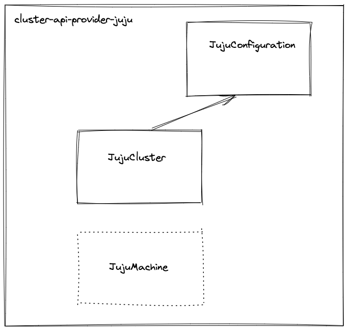

# cluster-api-provider-juju


This is the [juju](https://juju.is/) provider for cluster API.
It enables you to provision [Charmed Kubernetes](https://ubuntu.com/kubernetes) infrastructure.



### Development

- `microk8s config > ~/config && export KUBECONFIG=~/config`
- `clusterctl init`
- Install local CRD's with `make install`
- Run the `main.go` locally and connect to the cluster


#### Dependencies

- Either with MacOS or LinuxBrew

```
brew install kubebuilder kustomize clusterctl
```

- Optionally using `microK8s` or `kind`
  - `snap install microk8s --classic`
  - `brew install kind`
